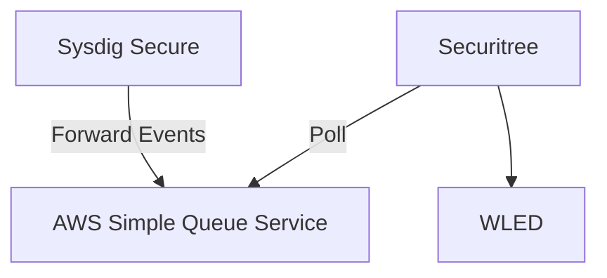

# runtime-securitree
A Go application to light up a Christmas tree with [Sysdig Secure](https://sysdig.com/products/secure/) runtime security events


## Architecture


Sysdig Secure events are forwarded to AWS SQS. The Securitree app polls the message queue and updates the LED string light colors using [WLED](https://kno.wled.ge/)'s JSON API. Light colors indicate the severity of the received event (high, medium, low, info).

## Building
The binary can be built using native Go tooling.
```
go build -o securitree cmd/securitree.go
```

A Dockerfile is also provided for building a container image:
```
docker buildx build --platform linux/amd64,linux/arm64 -t runtime-securitree .
```
